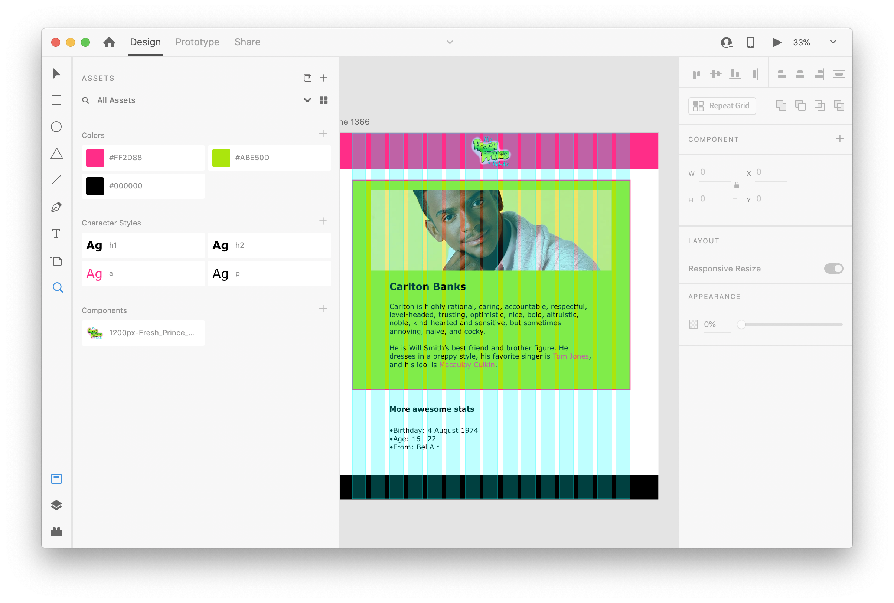

# Assignment 3D Carlton with a visual

*PLEASE READ THIS **ENTIRE** DOCUMENT FIRST*

* [the assignment](#the-assignment)
* [submitting-your-work](#submitting-your-work)


## The assignment



Download this repo and have a look at the ```assignments/carlton-with-a-visual.xd``` file. You can make a copy of the previous Carlton project.

Make sure you recreate the layout from the Adobe XD file as good as possible. The used colors need to be correct!

Make sure that this edited website works on your local machine. 

## Submitting your work
Create a new branch called **gh-pages** and upload your local work into this branch.
Start a new **pull request**, select one **reviewer** and make sure to put the **GitHub Pages URL** in the comment section. Do **not** merge this Pull Request yourself. That's up to the reviewer to decide (merging is approving the assignment).
